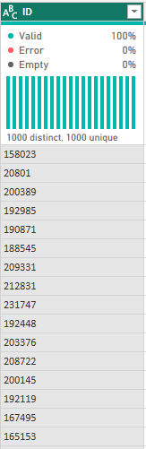
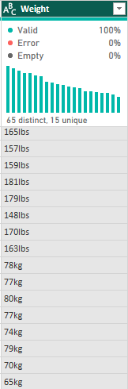
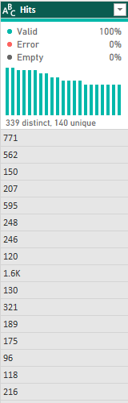

# FIFA21-Data-Analysis

## Introduction
This documentation describes the fifa21 raw data v2 dataset's data cleaning procedure.
I came across the dataset from a data cleaning challenge organized by some data enthusiasts in a bid to create an enabling environment for all levels of data analysts to flex their data cleaning skills.

## Problem Statement
1. What is the contract duration years?*
2. What players are on loan or free contract?
3. What are the players' values, Wages, and Release clause in Dollars?
4. What are the players’ heights in (cm) and Weights in (lbs)?

## Data Sourcing
The fifa21 raw data v2 dataset was sourced from kaggle [here](https://www.kaggle.com/datasets/yagunnersya/fifa-21-messy-raw-dataset-for-cleaning-exploring). It contains 18,979 rows and 77 columns.

## Data Cleaning
The dataset was efficiently cleaned using the Microsoft Power Query Editor of Microsoft Power  BI. The applied steps includes:
- **The ID column**

I changed the datatype from whole number to text.

Before              | After
:------------------:|:------------------:
   |  

- **The photoUrl column**

This contained URLs to each player's photo but an error was noticed which caused the players’ photos to be unavailable. To fix this, I replaced “.com” and “_60” with “.net” and “_240” in the Url using the replace value function.

Before                    | After
:------------------------:|:------------------:
 |  

- **The OVA, POT & BOV columns**

These columns contained values that were measured as percentages and represented as text data type. To fix this, I divided the values in each columns by 100 and changed the data type to percentage.

Before                        | After
:----------------------------:|:------------------:
  |  

- **The Contract column**

This contained the contract start year and contract terminated year (separated by “~”), values “Free”(for players on a free transfer), and “Loan”(for players on Loan).

To fix this, I created a conditional column named “Agreement” to identify the type of agreement for each player and changed the data type to text.

Then, I split the Contract column by delimiter to extract the Contract(Start) Year and Contract(Terminated) Year from the "Contract" column, changed the data type in the column “Contract.1” and “Contract.2” to number, replaced errors in column “Contract.1” with 0, replaced value “null” in column “Contract.2” with “0”, changed the data type of column “Contract.2” to number, renamed column “Contract.1” to “Contract(Start) Year” and column “Contract.2” to “Contract(Terminated) Year”.

Before                      | After
:--------------------------:|:------------------:
   |   

Lastly, I inserted subtraction to the “Contract(Terminated) Year” column to get the duration of contract”, renamed the “Subtraction” column to “Duration of Contract”, changed the data type to whole number.

- **The Height column**

This had some values in centimeters(cm) and some in feet and inches(‘ and “). The player’s height is supposed to be in centimeters(cm). To fix this, I added a custom custom using the following formula:

`let
cm = if Text.Contains([Height],"cm") then Number.From(Text.BeforeDelimiter([Height],"cm")) else null,
ft = Number.From(Text.BeforeDelimiter([Height],"'")),
inch = Number.From(Text.BetweenDelimiters([Height],"'","""")),
Result = if cm is null then (ft*30.48)+(inch*2.54) else cm
in
Result`

Then, I changed the data type to whole number.

Before                    | After
:------------------------:|:------------------:
   |   .png)

- **The Weight column**

This had some values in kilogram(kg) and some in pounds(lbs). The player’s weight is supposed to be in Pounds(lbs). To fix this, I added a custom custom using the following formula:

`if Text.Contains([Weight],"kg") then Number.From(Text.BeforeDelimiter([Weight],"kg"))*2.20 else Number.From(Text.BeforeDelimiter([Weight],"lbs"))`

Then, I changed the data type to whole number.

Before                    | After
:------------------------:|:------------------:
   |   .png)

- **The Value column**

This had some values represented in different format, with the Euro(€) symbol. The player’s worth is supposed to be in Dollars($). To fix this, I replaced the Euro(€) symbol with blank, I added a custom custom using the following formula:

`(if Text.Contains([Value],"M") then Number.From(Text.BeforeDelimiter([Value],"M"))*1000000 else Number.From(Text.BeforeDelimiter([Value],"K"))*1000)*1.06`

Then, I changed the data type to fixed decimal number.

Before                   | After
:-----------------------:|:------------------:
   |   .png)

- **The Wage column**

This had some values in represented in different format, with the Euro(€) symbol. The player’s worth is supposed to be in Dollars($). To fix this, I replaced the Euro(€) symbol with blank, I added a custom custom using the following formula:

`(if Text.Contains([Wage],"K") then Number.From(Text.BeforeDelimiter([Wage],"K"))*1000 else Number.From(Text.BeforeDelimiter([Wage],""))*100)*1.06`

Then, I changed the data type to fixed decimal number, and removed errors.

Before                  | After
:----------------------:|:------------------:
   |   .png)

- **The Release Clause column**

This had some values in represented in different format, with the Euro(€) symbol. The player’s worth is supposed to be in Dollars($). To fix this, I replaced the Euro(€) symbol with blank, I added a custom custom using the following formula:

`(if Text.Contains([Release Clause],"M") then Number.From(Text.BeforeDelimiter([Release Clause],"M"))*1000000 else Number.From(Text.BeforeDelimiter([Release Clause],"K"))*1000)*1.06`

Then, I changed the data type to fixed decimal number.

Before                            | After
:--------------------------------:|:------------------:
   |   .png)

Note: I removed unnecessary columns afterwards.

- **The W/F, SM, and IR columns**

These columns had star(★) symbol added to its values. To fix this, I replaced the star(★) symbol with blank by using replace value function.
Then, I changed the data type to whole number.

Before                      | After
:--------------------------:|:------------------:
   |   

- **The Hits column**

This had values represented in thousands, with the letter "K" (e.g. 1.6K instead of 1600). To fix this, I added a custom custom using the following formula:

`if Text.Contains([Hits], "K") then Number.FromText(Text.BeforeDelimiter([Hits], "K"))*1000 else Number.FromText([Hits])`

Then, I changed the data type to whole number, removed unnecessary column, renamed the custom column to Hits.

Before                  | After
:----------------------:|:------------------:
   |   

## Conclusion

In conclusion, the fifa21 raw data v2 dataset was efficiently cleaned. In the absence of the data cleaning, the exploratory data analysis will be unsuccessful and produce false insights.

